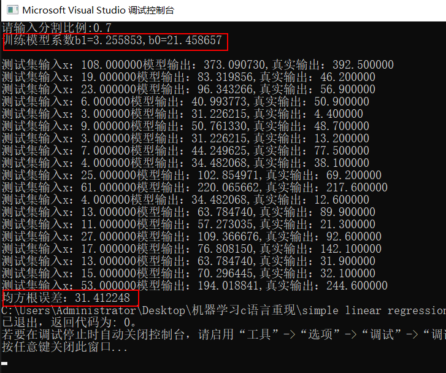

# 机器学习c语言复现

> 注：所有算法均对任意数据集通用

## 1、simple linear regression（20'）

<table>
    <tr>
         <td>
1、算法输入
</td>
         <td >
训练集与测试集的分割比例
</td>
    </tr>
    <tr>
         <td>
2、算法输出
</td>
         <td >
输出参数b0、b1和RMSE均方根误差，模型为 y=b0+b1*x
</td>
    </tr>
    <tr>
        <td>
3、算法评估
 </td>
        <td >
RMSE均方根误差
</td>
    </tr>
    <tr>
        <td>
4、测试结果
 </td>
        <td >
用瑞典保险数据集“insurance.csv"测试，训练模型的RMSE约为31，比基准成绩72好得多
</td>
    </tr>
</table>

## 2、multivariate linear regression（25'）

<table>
    <tr>
         <td>
1、算法输入
</td>
         <td >
总折数k、学习率、更新次数
</td>
    </tr>
    <tr>
         <td>
2、算法输出
</td>
         <td >
单折误差、平均误差
</td>
    </tr>
    <tr>
        <td>
3、算法评估
 </td>
        <td >
平均RMSE
</td>
    </tr>
    <tr>
        <td>
4、测试结果
 </td>
        <td >
用“winequality-white.csv"测试，预测白酒质量，平均RMSE远低于基线值0.148
</td>
    </tr>
</table>

<table>
    <tr>
        <td >

</td>
        <td >
 
</td>
    </tr>
</table>

## 3、perceptron（25'）

* **预处理：在excel中把class类别（样本最后一列）替换为0/1**

<table>
    <tr>
         <td>
1、算法输入
</td>
         <td >
总折数k
</td>
    </tr>
    <tr>
         <td>
2、算法输出
</td>
         <td >
单折正确率、平均正确率
</td>
    </tr>
    <tr>
        <td>
3、算法评估
 </td>
        <td >
平均正确率
</td>
    </tr>
    <tr>
        <td>
4、测试结果
 </td>
        <td >
用“sonar.all-data.csv"测试，进行矿山和岩石二分类，平均正确率约73%，远高于基线值50%
</td>
    </tr>
</table>

<table>
    <tr>
        <td >

</td>
        <td >
 
</td>
    </tr>
</table>

## 4、naive bayes（30'）

* **预处理：在excel中把class类别（样本最后一列）替换为0、1、2……**

<table>
    <tr>
         <td>
1、算法输入
</td>
         <td >
总折数k
</td>
    </tr>
    <tr>
         <td>
2、算法输出
</td>
         <td >
单折正确率、平均正确率
</td>
    </tr>
    <tr>
        <td>
3、算法评估
 </td>
        <td >
平均正确率
</td>
    </tr>
    <tr>
        <td>
4、测试结果
 </td>
        <td >
用“iris.csv"测试，进行多分类; 平均正确率约96%，远高于基线值26%
</td>
    </tr>
</table>

<table>
    <tr>
        <td >

</td>
        <td >
 
</td>
    </tr>
</table>
